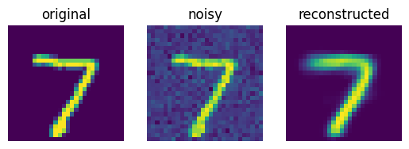
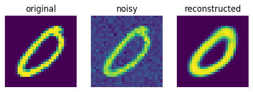
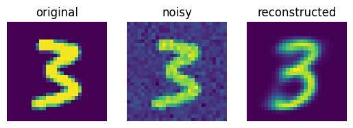
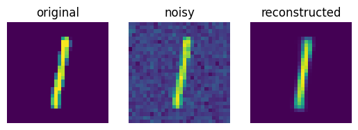
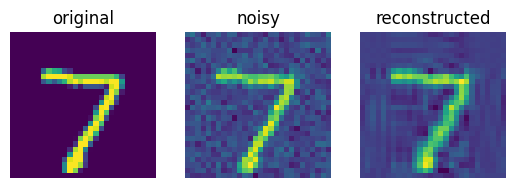
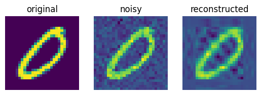
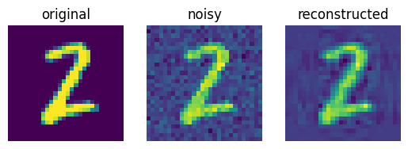
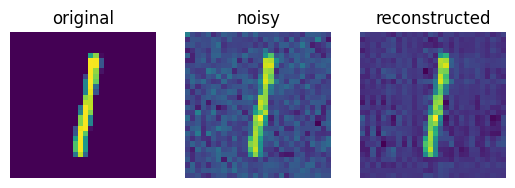

# Image-Denoising-using-Autoencoder-and-PCA-ML-course
This project implements image denoising techniques using Autoencoders and Principal Component Analysis (PCA). The goal is to compare the effectiveness of neural network-based and statistical approaches in removing noise from images.

## Overview
Image denoising is an essential preprocessing step in computer vision and image analysis. This project leverages two approaches:

1. **Autoencoder**: A type of neural network trained to reconstruct input data while minimizing noise. The autoencoder learns a compressed representation of the image, which is used for denoising.

2. **PCA (Principal Component Analysis)**: A statistical technique used to reduce dimensionality and extract the principal features of an image while discarding noise.

## Dataset
The project utilizes a standard image dataset such as:
- MNIST

Each image is corrupted by adding synthetic noise (e.g., Gaussian noise), simulating real-world scenarios.

---

## Results
Here are some examples of the results achieved using both methods:

### **Autoencoder Results**
The following examples demonstrate the denoising performance of the Autoencoder:
- **Original Image** | **Noisy Image** | **Denoised Image (Autoencoder)**:
  
  
  
  

### **PCA Results**
The following examples demonstrate the denoising performance of PCA:
- **Original Image** | **Noisy Image** | **Denoised Image (PCA)**:
  
  
  
  

